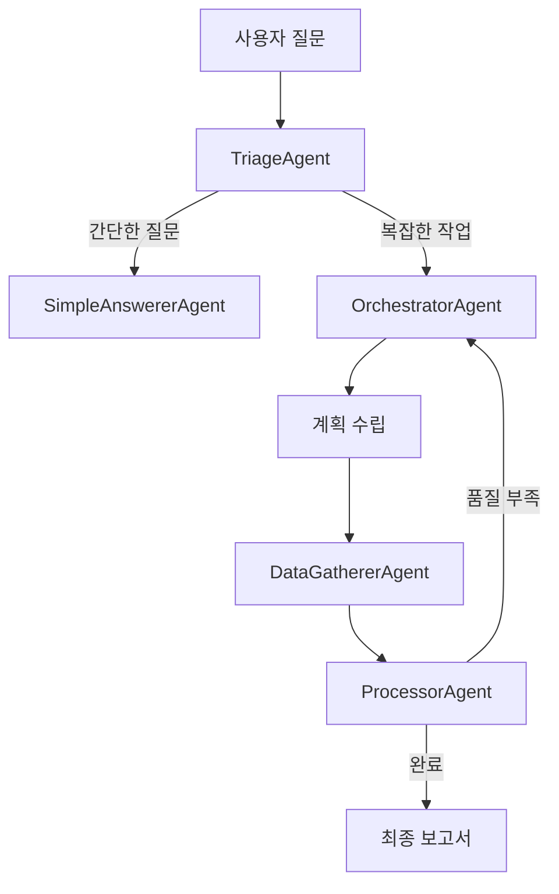

# Multi-Agent RAG System - Developer Documentation

> For project overview and architecture, see [root README](../README.md)

This document provides technical implementation details for developers working on the Multi-Agent RAG System.

---

## System Architecture

### Project Structure (v4.0)
```
multiagent-rag-system/
├── backend/
│   ├── app/
│   │   ├── core/                      # 핵심 비즈니스 로직
│   │   │   ├── agents/                # AI 에이전트들
│   │   │   │   ├── orchestrator.py    # TriageAgent, OrchestratorAgent
│   │   │   │   ├── worker_agents.py   # DataGathererAgent, ProcessorAgent
│   │   │   │   └── conversational_agent.py  # SimpleAnswererAgent
│   │   │   ├── models/                # 데이터 모델들
│   │   │   │   └── models.py          # StreamingAgentState, SearchResult
│   │   │   └── config/                # 설정 관리
│   │   │       ├── env_checker.py     # 환경 변수 체크
│   │   │       ├── rag_config.py      # RAG 설정
│   │   │       └── report_config.py   # 보고서 템플릿 설정
│   │   │
│   │   ├── services/                  # 외부 서비스 연동
│   │   │   ├── database/              # 데이터베이스 서비스
│   │   │   │   ├── postgres_rag_tool.py    # PostgreSQL RAG
│   │   │   │   ├── neo4j_rag_tool.py       # Neo4j RAG
│   │   │   │   └── mock_databases.py       # 목 데이터베이스
│   │   │   ├── search/                # 검색 서비스
│   │   │   │   └── search_tools.py    # 웹 검색, Vector DB 검색
│   │   │   ├── charts/                # 차트 생성 서비스
│   │   │   ├── templates/             # 템플릿 관리
│   │   │   └── builders/              # 프롬프트 빌더
│   │   │
│   │   ├── utils/                     # 유틸리티 함수들
│   │   │   ├── memory/                # 계층적 메모리 시스템
│   │   │   ├── analyzers/             # 분석 도구
│   │   │   └── testing/               # 테스트 유틸리티
│   │   │
│   │   ├── tools/                     # 개발 도구들
│   │   ├── tests/                     # 테스트 파일들
│   │   └── main.py                    # FastAPI 메인 서버
│   │
│   ├── Dockerfile
│   └── requirements.txt
│
├── frontend/                          # Next.js 프론트엔드
│   ├── src/
│   │   ├── app/
│   │   │   ├── page.js                # 메인 채팅 인터페이스
│   │   │   └── globals.css            # 스타일링 (Claude 스타일)
│   │   └── components/
│   │       ├── ChartComponent.js      # 동적 차트 렌더링
│   │       └── SourcesPanel.js        # 출처 정보 패널
│   │
│   ├── package.json
│   └── Dockerfile
│
├── docker-compose.yml                 # 전체 시스템 오케스트레이션
└── README.md
```

### Core Agent Architecture (Custom AFLOW)

#### 1. **TriageAgent** (Entry Point)
```python
# 자동 분류: 간단한 대화 vs 복잡한 작업
flow_type = "chat" | "task"
```

#### 2. **OrchestratorAgent** (Planning)
```python
# 동적 계획 수립
plan = {
    "steps": [
        {"agent": "DataGathererAgent", "tool": "web_search", "inputs": {...}},
        {"agent": "ProcessorAgent", "processor_type": "integrate_context", ...},
        {"agent": "ProcessorAgent", "processor_type": "generate_report", ...}
    ]
}
```

#### 3. **Worker Agents** (Execution)
- **DataGathererAgent**: 다중 소스 데이터 수집
  - Web Search (최신 정보 우선)
  - Vector DB Search
  - Graph DB Search (Neo4j)
  - RDB Search (PostgreSQL)
  - Web Scraping

- **ProcessorAgent**: 데이터 처리 및 보고서 생성
  - Context Integration
  - Result Criticism
  - Report Generation (ReAct 지원)
  - Chart Generation

#### 4. **SimpleAnswererAgent** (Direct Response)
```python
# 간단한 질문에 대한 직접 응답
query = "안녕하세요" → SimpleAnswererAgent
query = "복잡한 시장 분석 요청" → OrchestratorAgent
```

---

## Quick Start

### Prerequisites
- Python 3.10
- Node.js 20+
- Docker 27.5.1+
- Docker Compose 1.29.2+
- API Keys: Google Gemini, OpenAI (선택), Serper (선택)

### Installation

#### 1. Docker Compose 방식 (권장)
```bash
# 1. 저장소 클론
git clone https://github.com/your-org/crowdworks-multiagent-system.git
cd crowdworks-multiagent-system

# 2. Docker 볼륨 생성 (최초 1회)
docker volume create elasticsearch_es_data
docker volume create neo4j_data_original

# 3. 환경 변수 설정
cp .env.example .env
# .env 파일에서 API 키들 설정 (아래 Configuration 섹션 참조)

# 4. 전체 시스템 실행
docker-compose up --build -d

# 5. 시스템 상태 확인
docker-compose ps

# 6. 접속 확인
# Frontend: http://localhost:3000
# Backend API: http://localhost:8000/health
# Neo4j Browser: http://localhost:7474
# Kibana: http://localhost:5601
```

**포함되는 서비스:**
- PostgreSQL 14 (포트 5433)
- Elasticsearch 8.11.0 + Kibana (포트 9200, 5601)
- Neo4j 5.15.0 (포트 7474, 7687)
- Backend FastAPI (포트 8000)
- Frontend Next.js (포트 3000)
- Crawler RDB (KAMIS 데이터 수집)
- Neo4j App (그래프 데이터 처리)

#### 2. 로컬 개발 방식
```bash
# 데이터베이스는 Docker로 실행
docker-compose up postgres elasticsearch neo4j -d

# Backend 실행
cd multiagent-rag-system/backend
python -m venv venv
source venv/bin/activate  # Linux/Mac (Windows: venv\Scripts\activate)
pip install -r requirements.txt
export GEMINI_API_KEY_1="your-gemini-key"
export GEMINI_API_KEY_2="your-gemini-key-backup"
uvicorn app.main:app --reload --port 8000

# Frontend 실행 (별도 터미널)
cd multiagent-rag-system/frontend
npm install
npm run dev
```

---

## Configuration

### 환경 변수 (.env)

프로젝트 루트 디렉토리에 `.env` 파일을 생성하고 다음 변수들을 설정하세요:

```bash
# LLM API Keys (필수)
GEMINI_API_KEY_1=your-gemini-api-key-1
GEMINI_API_KEY_2=your-gemini-api-key-2
GOOGLE_API_KEY=your-google-api-key

# LLM API Keys (선택)
OPENAI_API_KEY=sk-your-openai-key

# Search API Keys (선택)
SERPER_API_KEY=your-serper-key
LANGSMITH_API_KEY=your-langsmith-key

# Database Configuration (Docker Compose 사용시 자동 설정됨)
POSTGRES_DB=crowdworks_db
POSTGRES_USER=crowdworks_user
POSTGRES_PASSWORD=your-secure-password
POSTGRES_HOST=postgres
POSTGRES_PORT=5432

ELASTICSEARCH_HOST=http://elasticsearch:9200

NEO4J_URI=bolt://neo4j:7687
NEO4J_USER=neo4j
NEO4J_PASSWORD=your-neo4j-password

# Frontend Configuration
NEXT_PUBLIC_API_URL=http://localhost:8000

# Feature Flags (선택)
USE_REACT_AGENT=false  # true로 설정하면 복잡한 추론 활성화
USE_LANGGRAPH=true     # LangGraph 워크플로우 사용 여부
```

**주의사항:**
- `GEMINI_API_KEY_1`, `GEMINI_API_KEY_2`: 필수 - 시스템의 주요 LLM
- Docker Compose 사용시 데이터베이스 연결 정보는 컨테이너 간 내부 통신으로 자동 설정됩니다
- 로컬 개발시에는 `POSTGRES_HOST=localhost`, `POSTGRES_PORT=5433`으로 변경 필요
- **보안**: 실제 운영 환경에서는 반드시 강력한 비밀번호로 변경하세요

### 시스템 설정
```python
# ProcessorAgent ReAct 모드 설정
processor_agent = ProcessorAgent(use_react=True)  # 복잡한 추론 활성화

# Triage 민감도 조정 (간단한 질문 vs 복잡한 작업)
triage_threshold = 0.7  # 높을수록 더 많은 질문을 복잡한 작업으로 분류
```

---

## Features

### 핵심 기능
- **동적 워크플로우**: LangGraph 기반 조건부 실행 및 루프 처리
- **실시간 스트리밍**: Server-Sent Events로 검색 과정 실시간 표시
- **Claude 스타일 UI**: 검색 결과 박스, 컴팩트한 디자인, 다크 테마
- **다중 소스 검색**: Web + Vector DB + Graph DB + RDB 통합
- **자동 차트 생성**: Chart.js 기반 동적 데이터 시각화
- **메모리 관리**: 대화 히스토리 및 컨텍스트 유지

### 워크플로우 예시


### 실시간 스트리밍 UI
```javascript
// 검색 과정 실시간 표시
{
  "type": "status",
  "message": "웹에서 정보 수집 중..."
}

// 검색 결과 박스 표시
{
  "type": "search_results",
  "tool_name": "웹 검색",
  "results": [...]
}

// 보고서 내용 스트리밍
{
  "type": "content",
  "chunk": "## 시장 분석 결과\n\n..."
}
```

---

## Development

### 아키텍처 확장

#### 새로운 데이터 소스 추가
```python
# services/search/search_tools.py에 새 도구 추가
@tool
def new_data_source_search(query: str) -> List[Dict]:
    """새로운 데이터 소스 검색"""
    return search_results

# worker_agents.py의 DataGathererAgent에 매핑 추가
self.tool_mapping = {
    "new_source": self._new_source_search,
    # ... 기존 도구들
}
```

#### Agent 동작 커스터마이징
```python
# ProcessorAgent의 ReAct 모드 커스터마이징
class ProcessorAgent:
    def __init__(self, use_react: bool = False):
        self.use_react = use_react  # 환경변수 USE_REACT_AGENT로도 제어 가능

    async def _generate_report_streaming(self, data, query):
        if self.use_react:
            # 복잡한 추론과 도구 사용
            async for chunk in self._react_agent_streaming_chunks(...):
                yield chunk
        else:
            # 빠른 직접 생성
            async for chunk in self._fallback_report_generation_streaming_chunks(...):
                yield chunk
```

#### 프론트엔드 UI 커스터마이징
```javascript
// 검색 결과 박스 스타일 수정
.claude-search-results {
  max-width: 600px;  /* 컴팩트한 너비 */
  margin: 16px auto; /* 중앙 정렬 */
}

// 새로운 메시지 타입 처리
case "custom_result":
  // 커스텀 결과 렌더링 로직
  break;
```

### 테스트 실행
```bash
# Backend 테스트
cd backend
python -m pytest tests/
python tests/test_connection.py

# Frontend 테스트
cd frontend
npm test

# 전체 시스템 테스트
docker-compose -f docker-compose.test.yml up
```

---

## Docker Commands

### 시스템 관리
```bash
# 전체 시스템 시작 (백그라운드)
docker-compose up -d

# 전체 시스템 시작 (로그 확인)
docker-compose up

# 전체 시스템 재빌드 및 시작
docker-compose up --build -d

# 시스템 상태 확인
docker-compose ps

# 시스템 종료
docker-compose down

# 시스템 종료 (볼륨 포함 - 주의: 데이터 삭제됨)
docker-compose down -v
```

### 개별 서비스 관리
```bash
# 특정 서비스만 재시작
docker-compose restart backend
docker-compose restart frontend
docker-compose restart postgres
docker-compose restart elasticsearch

# 특정 서비스 로그 확인
docker-compose logs -f backend
docker-compose logs -f frontend
docker-compose logs -f crawler-rdb

# 모든 서비스 로그 확인
docker-compose logs -f

# 컨테이너 접속
docker-compose exec backend bash
docker-compose exec frontend sh
docker exec -it multiagent-backend bash
```

### 데이터베이스 관리
```bash
# PostgreSQL 접속
docker-compose exec postgres psql -U crowdworks_user -d crowdworks_db

# Neo4j 접속 (Browser에서 http://localhost:7474)
# 또는 Cypher Shell
docker-compose exec neo4j cypher-shell -u neo4j -p 'your-password'

# Elasticsearch 상태 확인
curl http://localhost:9200/_cluster/health?pretty
```

### 트러블슈팅
```bash
# 특정 서비스 재빌드
docker-compose build --no-cache backend
docker-compose up -d backend

# 전체 캐시 무시 재빌드
docker-compose build --no-cache
docker-compose up -d

# 완전 정리 (이미지 포함)
docker-compose down -v --rmi all

# Docker 시스템 전체 정리
docker system prune -af
docker volume prune -f
```

---

## API Usage Examples

### 실시간 스트리밍 요청
```javascript
// Frontend에서 Server-Sent Events 사용
const eventSource = new EventSource('/query/stream', {
  method: 'POST',
  body: JSON.stringify({
    query: "건강기능식품 시장 동향 분석해줘",
    session_id: "unique-session-id"
  })
});

eventSource.onmessage = (event) => {
  const data = JSON.parse(event.data);

  switch(data.type) {
    case 'status':
      updateStatus(data.message);
      break;
    case 'search_results':
      addSearchResultBox(data.tool_name, data.results);
      break;
    case 'content':
      appendToMessage(data.chunk);
      break;
  }
};
```

### Backend API 직접 호출
```python
import requests

# 스트리밍 요청
response = requests.post('http://localhost:8000/query/stream',
    json={
        "query": "귀리 시장 분석 보고서 작성해줘",
        "session_id": "test-session"
    },
    stream=True
)

for line in response.iter_lines():
    if line:
        data = json.loads(line.decode('utf-8').replace('data: ', ''))
        print(f"Type: {data['type']}, Content: {data.get('message', data.get('chunk', ''))}")
```

### 다양한 질문 유형 예시
```python
# 간단한 질문 → SimpleAnswererAgent
"안녕하세요"
"오늘 날씨 어때요?"

# 복잡한 분석 요청 → OrchestratorAgent + DataGathererAgent + ProcessorAgent
"건강기능식품 시장의 최신 동향을 분석하고 향후 전망을 제시해줘"
"귀리 가격 변동 요인을 분석하고 차트로 시각화해줘"
"국내외 프로바이오틱스 시장 비교 분석 보고서 작성해줘"
```

---

## Performance & Scalability

### 시스템 성능 최적화
- **TTFT (Time To First Token)**: 500ms 이하 첫 응답
- **스트리밍 처리**: 실시간 청크 단위 전송으로 사용자 경험 향상
- **ReAct 선택적 활성화**: 간단한 질문은 빠른 처리, 복잡한 질문은 정확성 우선
- **에러 핸들링**: API 할당량 초과시 자동 폴백 처리

### 확장성 고려사항
```python
# 환경 변수를 통한 동적 설정
USE_REACT_AGENT=false  # 성능 우선시
USE_REACT_AGENT=true   # 정확성 우선시

# Agent별 독립적 확장 가능
DataGathererAgent  # 새로운 데이터 소스 추가 용이
ProcessorAgent     # 처리 로직 모듈화
```

---

## Troubleshooting

### 일반적인 문제 해결

#### 1. API 키 관련 오류
```bash
# 환경 변수 확인
python backend/app/core/config/env_checker.py

# 출력 예시:
# >> OPENAI_API_KEY: 설정 완료
# >> GOOGLE_API_KEY: 설정되지 않음
```

#### 2. Docker 컨테이너 문제
```bash
# 컨테이너 상태 확인
docker-compose ps

# 로그 확인
docker-compose logs backend
docker-compose logs frontend

# 완전 재시작
docker-compose down && docker-compose up --build
```

#### 3. 프론트엔드 연결 문제
```bash
# Backend API 응답 확인
curl http://localhost:8000/health

# 예상 응답:
# {"status": "healthy", "timestamp": "2025-08-04T...", "version": "3.0"}
```

#### 4. 스트리밍 중단 문제
- **원인**: API 할당량 초과, 네트워크 문제
- **해결**: 자동 폴백 시스템이 작동하여 기본 요약 제공
- **확인**: 브라우저 개발자 도구 → Network 탭에서 EventSource 연결 상태 확인

---

## Version History

### Recent Updates
- **v4.0.0** (2025.08.18):
  - 프론트엔드 렌더링 시스템 개선 (볼드 마크다운, 테이블, SOURCE 인용)
  - 백그라운드 모델 로딩으로 서버 시작 시간 최적화
  - Neo4j 그래프 검색 결과 포맷 개선
  - SOURCE 번호 검증 시스템 강화
- **v3.0.0** (2025.08 1주차): Custom AFLOW 아키텍처 도입, 실시간 스트리밍 UI
- **v2.0.0** (2025.07 4주차): 모듈화 리팩토링 및 팀별 템플릿 시스템
- **v1.5.0** (2025.07 3주차): Docker 컨테이너화
- **v1.0.0** (2025.07 2주차): 초기 Multi-Agent RAG 시스템 구현
